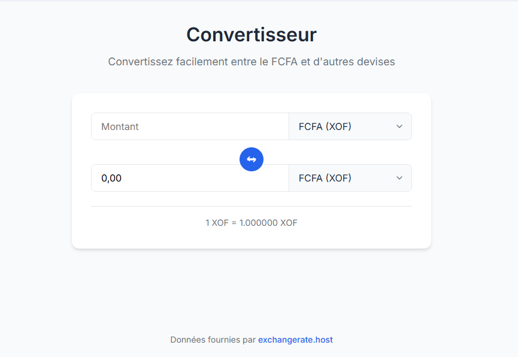

# Devises

## Description
Application web permettant de convertir un montant entre le FCFA et différentes devises (EUR, USD) en utilisant des taux de change en temps réel via une API externe.  
Ce projet est le **quatrième** du défi personnel **100 projets en 2026**.

---

## Objectifs du projet
- Manipuler le DOM avec JavaScript
- Consommer une API externe avec `fetch`
- Gérer l’asynchronisme et les erreurs réseau
- Construire une interface web simple et responsive

---

## Plateforme
- Web (navigateur)

---

## Technologies utilisées
- HTML
- CSS
- JavaScript (Vanilla)
- API de taux de change

---

## Fonctionnalités
- Saisie d’un montant
- Sélection de la devise source (FCFA, EUR, USD, etc.)
- Sélection de la devise cible
- Récupération automatique des taux via API
- Conversion instantanée
- Affichage du taux utilisé
- Message d’erreur en cas de problème réseau ou API

---

## Design & UX
- Interface sobre et moderne
- Mise en page centrée
- Responsive (mobile et desktop)
- Navigation simple et intuitive

---

## Captures d’écran

---

## Ce que j’ai appris
- Manipulation du DOM
- Requêtes HTTP avec JavaScript
- Gestion des promesses et async/await
- Validation des entrées utilisateur
- Structuration d’une petite application web

---

## Améliorations possibles
- Historique des conversions
- Mise en cache des taux
- Mode hors ligne
- Ajout de graphiques d’évolution

---

## Statut du projet
 **Projet terminé**

